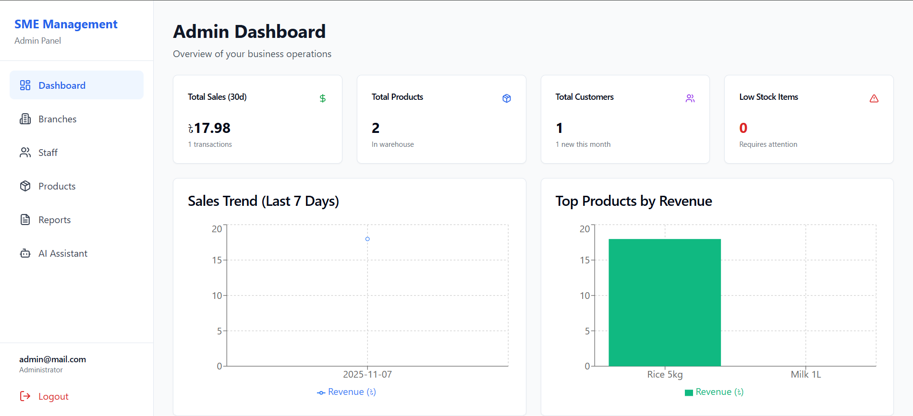
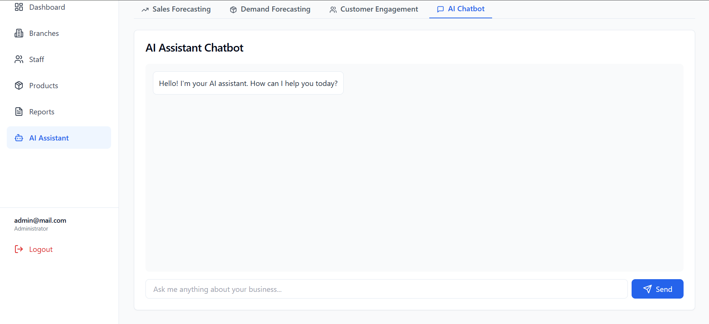
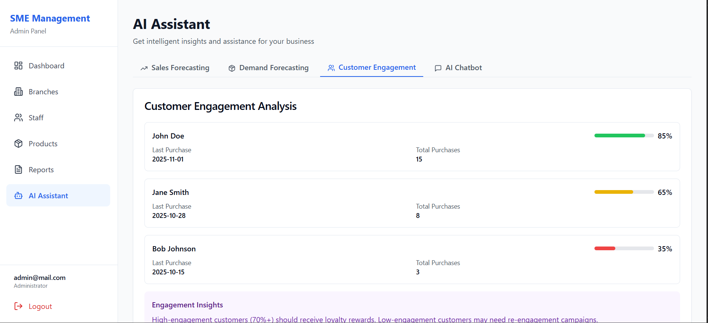
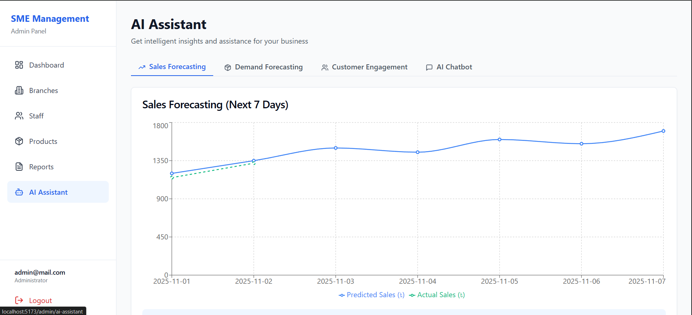

# Real-Time AI Analysis for SMEs

A comprehensive management system for Small and Medium Enterprises (SMEs) with integrated AI-powered analytics and forecasting capabilities. This application provides real-time insights, sales forecasting, demand prediction, and customer engagement analysis to help businesses make data-driven decisions.

## 🚀 Features

### Admin Features
- **Dashboard**: Overview of business operations with key metrics, sales trends, and top products
- **Branch Management**: Create, update, and manage multiple business branches
- **Staff Management**: Manage staff accounts and assign them to branches
- **Product Management**: Add, edit, and manage product catalog
- **Reports**: Comprehensive business reports and analytics
- **AI Assistant**: 
  - Sales forecasting for the next 7 days
  - Product demand forecasting with trend analysis
  - Customer engagement scoring and analysis
  - Interactive AI chatbot for business insights

### Staff Features
- **Dashboard**: Branch-specific overview with sales and inventory metrics
- **Sales Management**: Record and track sales transactions
- **Inventory Management**: Monitor stock levels and manage inventory
- **Customer Management**: Maintain customer database and track customer information
- **Reports**: Generate and view branch-specific reports
- **AI Assistant**: Access AI-powered insights and recommendations

## 📸 Screenshots
### Admin Dashboard


### AI Chatbot


### AI Customer Engagement Analysis


### AI Product Demand Forcasting


### AI Sales Forcasting


## 🛠️ Tech Stack

- **Frontend Framework**: React 18.2.0 with TypeScript
- **Build Tool**: Vite 5.0.8
- **Routing**: React Router DOM 6.21.1
- **Styling**: Tailwind CSS 3.4.0
- **Charts & Visualization**: Recharts 2.10.3
- **HTTP Client**: Axios 1.6.2
- **Notifications**: React Hot Toast 2.4.1
- **Icons**: Lucide React 0.303.0
- **Utilities**: 
  - clsx 2.1.0
  - tailwind-merge 2.2.0

## 📋 Prerequisites

Before you begin, ensure you have the following installed:
- **Node.js** (v16 or higher)
- **npm** or **yarn** package manager

## 🔧 Installation

1. Clone the repository:
```bash
git clone https://github.com/yourusername/Real-Time-AI-analysis-for-SME-s.git
cd Real-Time-AI-analysis-for-SME-s
```

2. Install dependencies:
```bash
npm install
```

## 🚀 Getting Started

### Development Mode

Run the development server:
```bash
npm run dev
```

The application will be available at `http://localhost:5173`

### Build for Production

Create an optimized production build:
```bash
npm run build
```

### Preview Production Build

Preview the production build locally:
```bash
npm run preview
```

### Linting

Run ESLint to check code quality:
```bash
npm run lint
```

## 🔐 Authentication

The application uses role-based authentication with two user types:

### Default Test Accounts

**Admin Account:**
- Email: `admin@mail.com`
- Password: Any password (currently using mock authentication)

**Staff Account:**
- Email: `staff@mail.com`
- Password: Any password (currently using mock authentication)

> **Note**: The application currently uses mock authentication. For production use, connect to a backend API that implements proper authentication and authorization.

## 📁 Project Structure

```
Real-Time-AI-analysis-for-SME-s/
├── src/
│   ├── App.tsx                 # Main application component with routing
│   ├── main.tsx                # Application entry point
│   ├── index.css               # Global styles
│   ├── contexts/
│   │   └── AuthContext.tsx     # Authentication context provider
│   ├── pages/
│   │   ├── LoginPage.tsx       # Login page
│   │   ├── admin/              # Admin-specific pages
│   │   │   ├── Dashboard.tsx
│   │   │   ├── Branches.tsx
│   │   │   ├── Staff.tsx
│   │   │   ├── Products.tsx
│   │   │   ├── Reports.tsx
│   │   │   └── AIAssistant.tsx
│   │   └── staff/              # Staff-specific pages
│   │       ├── Dashboard.tsx
│   │       ├── Sales.tsx
│   │       ├── Inventory.tsx
│   │       ├── Customers.tsx
│   │       ├── Reports.tsx
│   │       └── AIAssistant.tsx
│   ├── services/
│   │   ├── api.ts              # API client configuration
│   │   └── mock.ts             # Mock data and services
│   └── lib/
│       └── utils.ts             # Utility functions
├── index.html                  # HTML template
├── package.json                # Project dependencies and scripts
├── vite.config.ts              # Vite configuration
├── tailwind.config.js          # Tailwind CSS configuration
├── tsconfig.json               # TypeScript configuration
└── README.md                   # Project documentation
```

## 🔌 API Integration

The application is configured to connect to a backend API. The API base URL is configured in `vite.config.ts`:

```typescript
proxy: {
  '/api': {
    target: 'http://localhost:8000',
    changeOrigin: true,
  },
}
```

Currently, the application uses mock data from `src/services/mock.ts`. To connect to a real backend:

1. Update the API endpoints in `src/services/api.ts`
2. Replace mock service calls with actual API calls
3. Ensure your backend API follows the expected data structure

## 🎨 AI Features

### Sales Forecasting
- Predicts sales for the next 7 days based on historical data
- Visualizes predicted vs actual sales using line charts
- Provides AI-generated insights and recommendations

### Demand Forecasting
- Analyzes product demand trends (increasing, stable, decreasing)
- Predicts future demand for each product
- Suggests inventory management actions

### Customer Engagement Analysis
- Calculates engagement scores based on purchase history
- Tracks customer purchase patterns
- Identifies high-value and at-risk customers

### AI Chatbot
- Interactive chat interface for business queries
- Provides insights on sales, inventory, and customer behavior
- Answers questions about business operations

## 🎯 Key Features

- **Role-Based Access Control**: Separate interfaces for admin and staff users
- **Real-Time Analytics**: Live dashboard updates with key business metrics
- **Data Visualization**: Interactive charts and graphs using Recharts
- **Responsive Design**: Mobile-friendly interface built with Tailwind CSS
- **Type Safety**: Full TypeScript support for better code quality
- **Modern UI/UX**: Clean, intuitive interface with toast notifications

## 🔄 Development Notes

- The application uses mock data by default for development and testing
- Protected routes ensure users can only access pages appropriate for their role
- Authentication tokens are stored in localStorage
- The app automatically redirects to login on authentication errors

## 📝 Scripts

- `npm run dev` - Start development server
- `npm run build` - Build for production
- `npm run preview` - Preview production build
- `npm run lint` - Run ESLint

## 🤝 Contributing

Contributions are welcome! Please feel free to submit a Pull Request.

## 📄 License

This project is open source and available under the MIT License.

## 👥 Authors

- Muradul Islam
- Sazibul Islam Siam
- Md Abdullah Ibne Aziz
- Marisa Parvez Oishy

## 🙏 Acknowledgments

- Built with React and TypeScript
- UI components styled with Tailwind CSS
- Charts powered by Recharts
- Icons from Lucide React

---

For questions or support, please open an issue on the GitHub repository.

